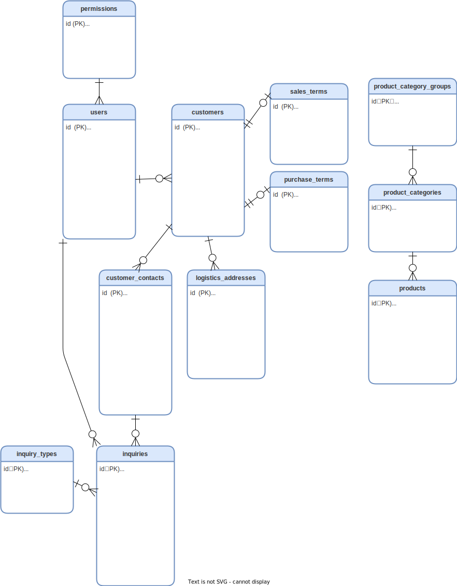

# Flagship 🚩

This is a core system designed to centralize key business flows from customer management to order management.

- **Public URL**: [Demo](https://app.rz-log.com/demo)  
  (Auto-login as a guest user)

---

## Overview 💻

### Key Features:
- Links orders and purchases, allowing management of gross profit per project.
- Suitable for businesses like wholesalers or dropshipping companies that don’t hold inventory.

### Development Background:  
Developed to streamline operations and leverage data effectively after the inefficiencies caused by using Excel for sales history and unnormalized data. This system centralizes business processes to improve sales performance.

---

## Core Features

- **User Management**: Employee registration, permissions, and termination management.
- **Business Partner**: Managing information for suppliers and customers.
- **Contacts**: Managing customer information linked to business partners.
- **Leads**: Tracking the origin of customer leads.
- **Billing**: Managing billing addresses with potential integration to accounting software.
- **Shipping Addresses**: Managing delivery addresses linked to business partners.
- **Order Management**: Linking orders with purchases for centralized management.
- **Inquiries**: Tracking customer inquiries and responses.
- **Sales History**: Logging sales-related interactions with customers.

---

## Technical Stack ⚙️

- **PHP**: 8.2.9  
- **Laravel**: 10.28  
- **React**: 18.2

### Infrastructure:
- **AWS** (EC2, Route53)
- **MySQL**: 8.0.36  
- **nginx**: 1.22.1  
- **Docker** (Development environment)

---

## System Installation & Table Definitions
- [Environment Setup](src/docs/installation.md)  
- [Table Definitions](src/docs/tables-definition.md)  
- **ER Diagram**:   
- **Infrastructure Diagram**: 

---

## Feature Overview

### Business Partner Management:
- Register and manage business partner information with multiple contacts and shipping addresses.

### Order Management:
- View orders with sales/purchase details and manage gross profits.

### Inquiries:
- Track customer inquiries and select customer information asynchronously.

---

## Design Considerations 💡

### Table Design:
Ensured high scalability and maintainability with normalization and proper table segregation.

### UI/UX:
- Asynchronous data retrieval for managing master data during entry.
- Customizable inquiry types based on user needs.
- Responsive design for mobile compatibility.
- Simplified product registration in a single screen.
- Date range picker for easy filtering.

---

## Development Flow

1. **Commit Messages**: Followed AngularJS’s prefix rule for easy-to-understand commit messages.
2. **Commit Granularity**: Ensured changes are related and easily understood during code reviews.
3. **Git Workflow**: Used GitHub flow with branches, push, PR, and merge processes.
4. **Coding Standards**: Followed back-end PRS-12 and front-end Google HTML/CSS guidelines. Applied ESLint and EditorConfig for consistency.

---

## Future Tasks

- **API Integration with Accounting Software**: Developing an API to synchronize billing master data and automate reconciliation tasks.
- **Quotation Generation**: Automatically generating quotations linked with business partners, inquiries, and orders.
